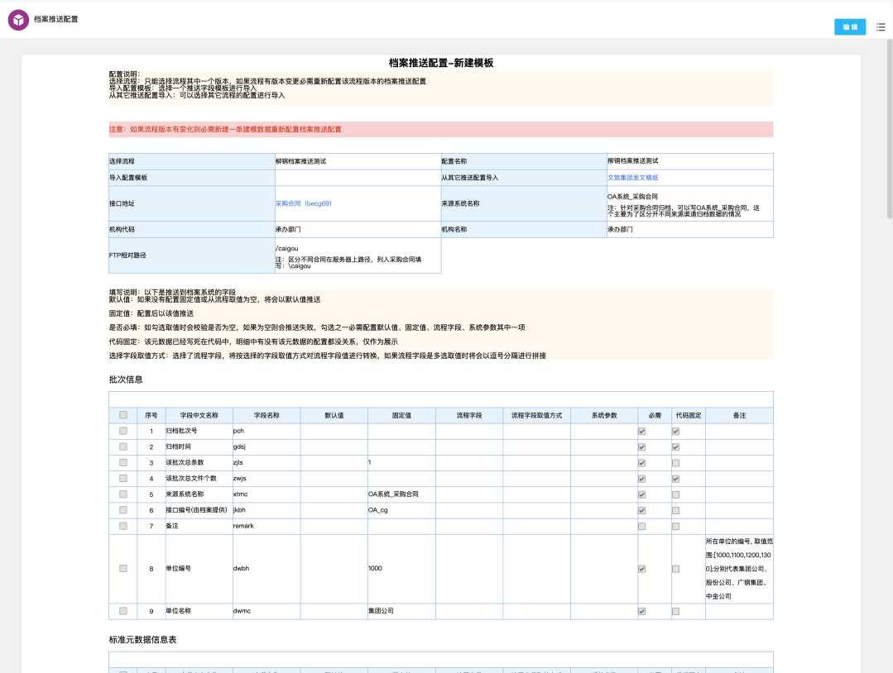

# 元果档案集成

E9元果档案集成，采用配置化开发，可部署到其它项目。

功能：

1. 流程归档时将流程数据推送到元果档案系统（同步）
2. 档案推送结果可在台账中查看
3. 档案推送内容配置化实现，可在建模中配置接口字段以及推送文件，少部分字段需要在代码中赋值
4. 可推送历史数据，在档案推送结果查询页面中，点击推送历史数据按钮，在对话框中选择要推送的流程类型即可推送该流程的历史数据
5. 推送文件自动将doc文档和图片转成pdf，默认使用wps进行转换，如果没有集成wps则使用第三方工具进行转换（转换效果没有wps好）
6. 自动生成流程表单pdf（需要开启流程存为文档，并勾选生成表单pdf）
7. 档案系统可调用OA接口，进行拒绝处理，将流程退回到指定节点，退回的节点可在建模中配置
8. 退回接口地址：/api/secondev/workflow/archive/open/reject ，该接口如果调用方不需要进行认证，需要将接口加入到白名单

## 部署说明

请查看开发包内的说明文档进行部署

## 开发包

