# 
泛微开发通用应用库 

这些都是我开发的一些功能，可以进行复用，欢迎大家使用。

## E10

### [泰坦档案集成（通用）](./E10/泰坦档案集成（通用）/README.md)

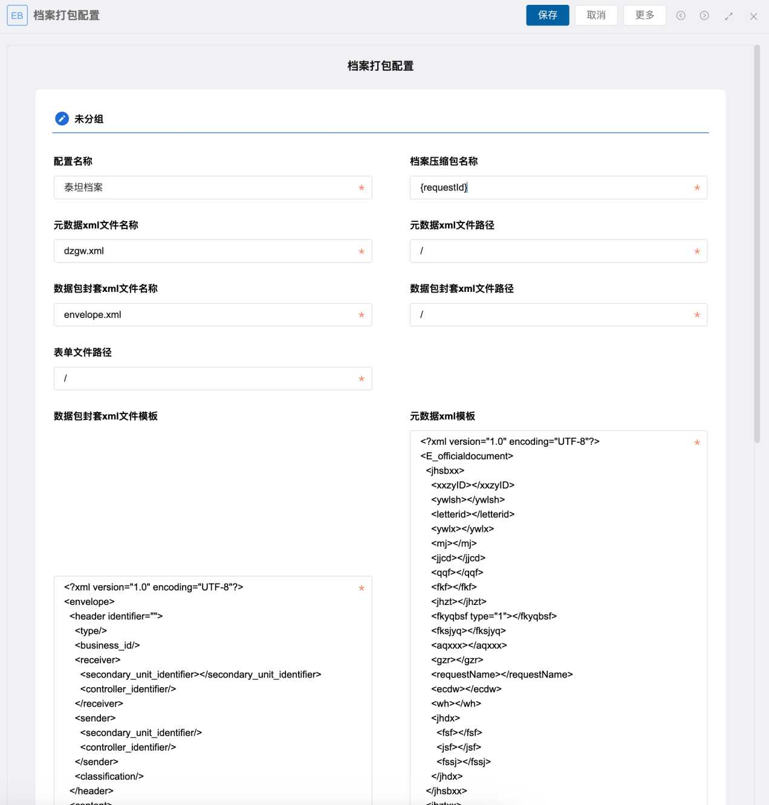

### [E10人力资源组织同步到E9](./E10/E10人力资源组织同步到E9/README.md)

.png)

### [E10自定义报表增加导出流程表单页面pdf功能](./E10/E10自定义报表增加导出流程表单页面pdf功能/README.md)

### [EB表格单元格合并](./E10/EB表格单元格合并/README.md)

### [E10流程表单明细表单元格合并](./E10/E10流程表单明细表单元格合并/README.md)

## E9

### [在任意页面使用二次密码验证](./E9/在任意页面使用二次密码验证/README.md)

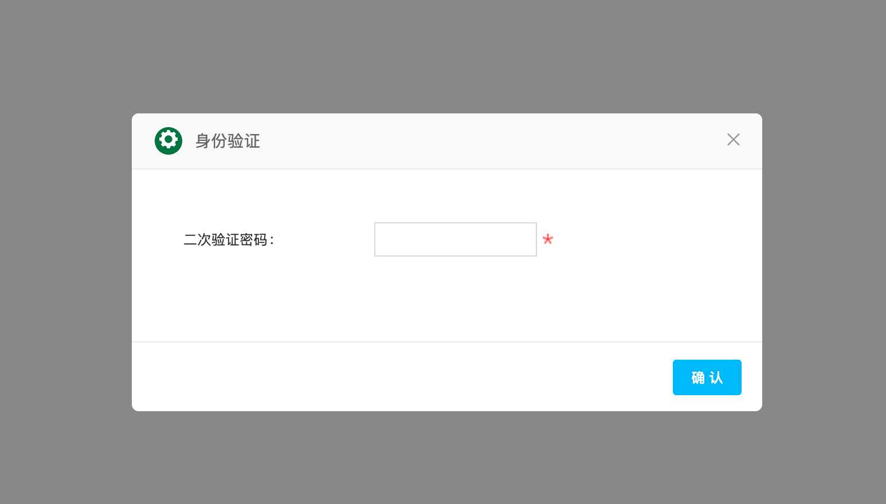

### [门户流程列表显示超时提示文本](./E9/门户流程列表显示超时提示文本/README.md)

### [门户公文列表自定义多字段排序](./E9/门户公文列表自定义多字段排序/README.md)

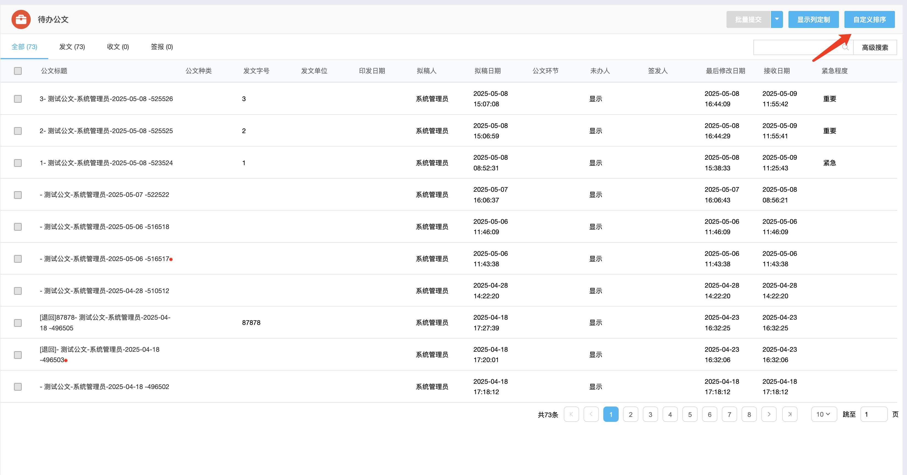

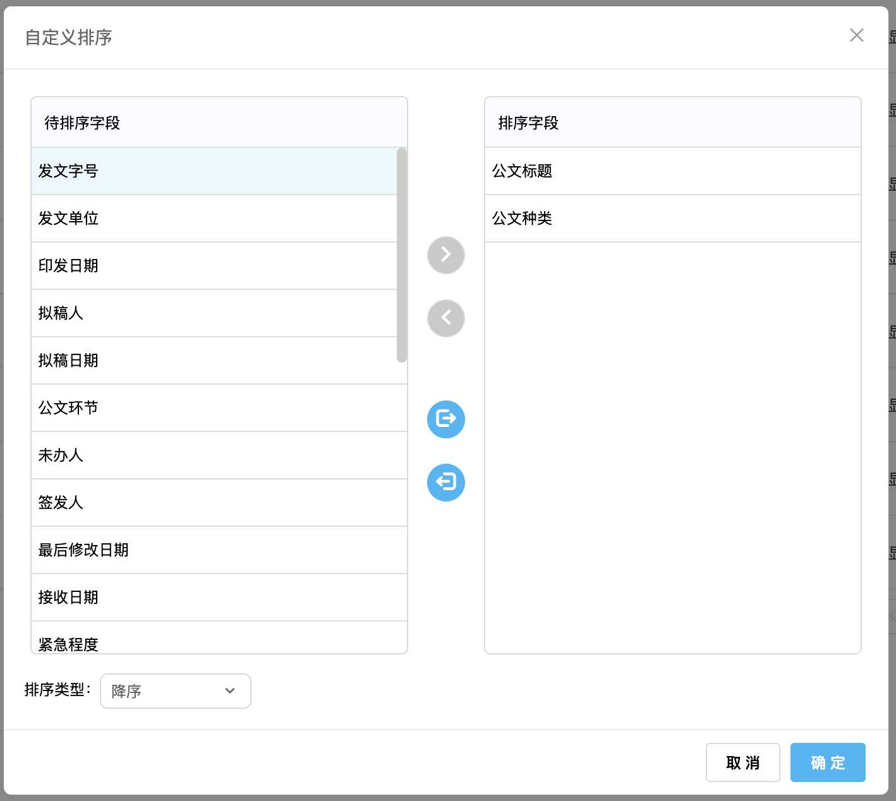

### [门户流程列表元素批量提交](./E9/门户流程列表元素批量提交/README.md)

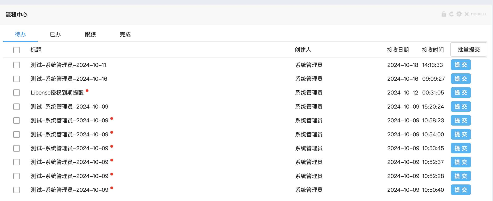

### [建模批量导入页面添加提示](./E9/建模批量导入页面添加提示/README.md)

### [建模查询批量编辑必填校验](./E9/建模查询批量编辑必填校验/README.md)

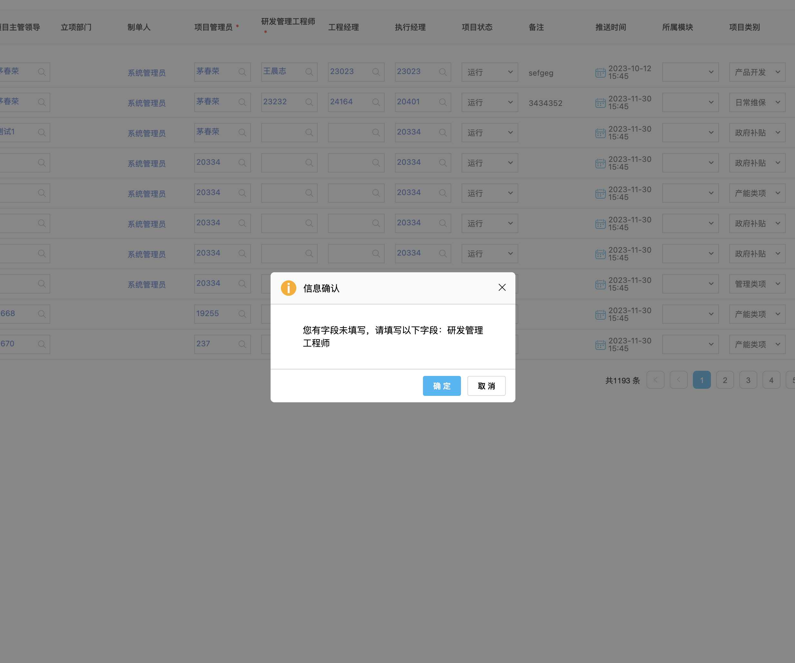

### [移动端流程快捷批注按钮](./E9/移动端流程快捷批注按钮/README.md)

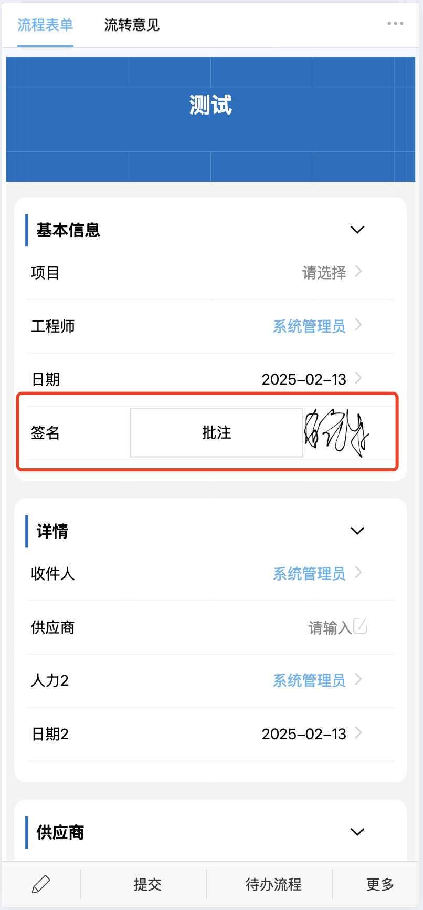

### [流程明细表字段批量维护](./E9/流程明细表字段批量维护/README.md)

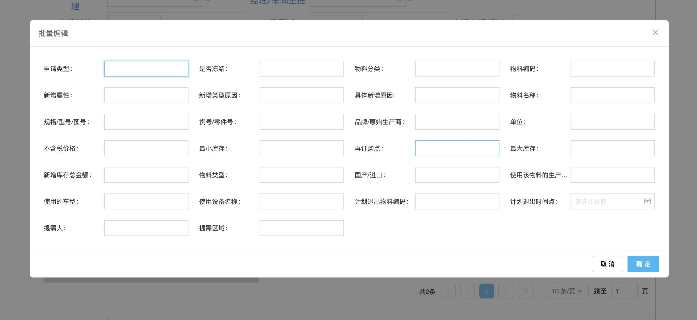

### [流程签字意见输入框粘贴时去掉格式](./E9/流程签字意见输入框粘贴时去掉格式/README.md)

### [移动端流程图片上传压缩大小](./E9/移动端流程图片上传压缩大小/README.md)

### [流程签字意见添加格式刷功能](./E9/流程签字意见添加格式刷功能/README.md)

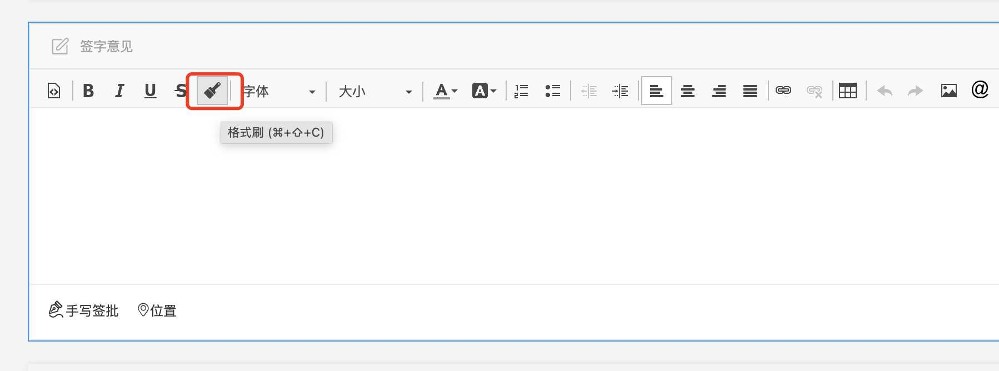

### [流程干预时默认节点前附加操作为否](./E9/流程干预时默认节点前附加操作为否/README.md)

.png)

### [流程表单信息助手](./E9/流程表单信息助手/README.md)

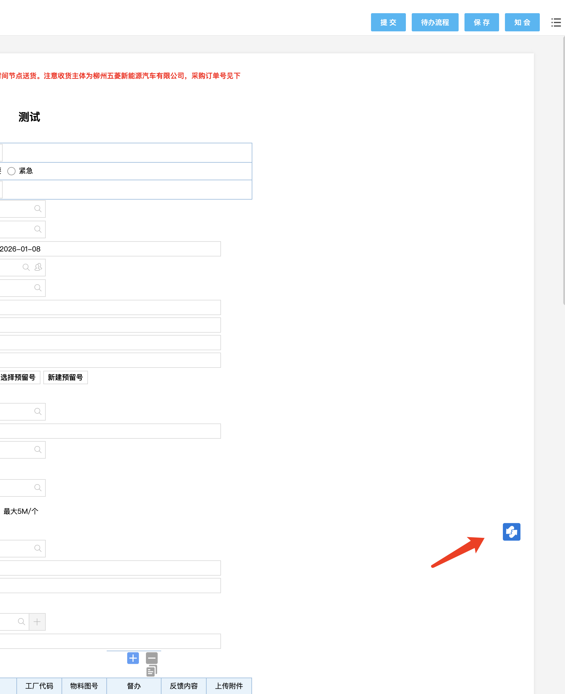

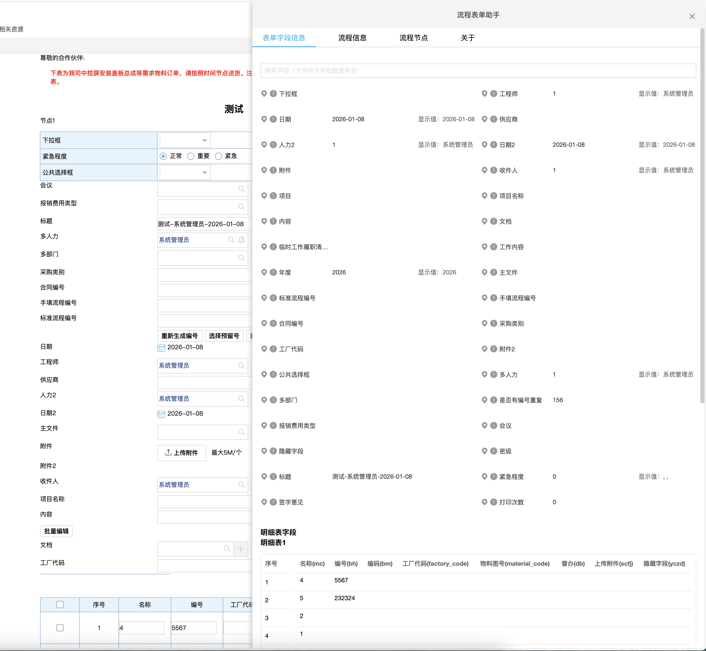

### [元果档案集成](./E9/元果档案集成/README.md)

### [量子档案集成](./E9/量子档案集成/README.md)

.png)

### [明细表单元格合并](./E9/明细表单元格合并/README.md)

